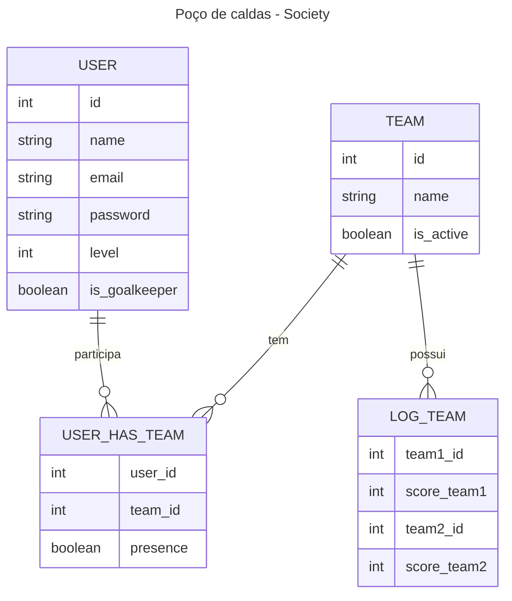

```mermaid
---
title: Poço de caldas - Society
---
erDiagram
    USER {
        int id
        string name
        string email
        string password
        int level
        boolean is_goalkeeper
    }
    USER_HAS_TEAM {
        int user_id
        int team_id
        boolean presence
    }
    USER ||--o{ USER_HAS_TEAM : participa
    TEAM ||--o{ USER_HAS_TEAM : tem
    TEAM {
        int id
        string name
        boolean is_active
    }
    TEAM ||--o{ LOG_TEAM : possui
    LOG_TEAM {
        int team1_id
        int score_team1
        int team2_id
        int score_team2
    }

```